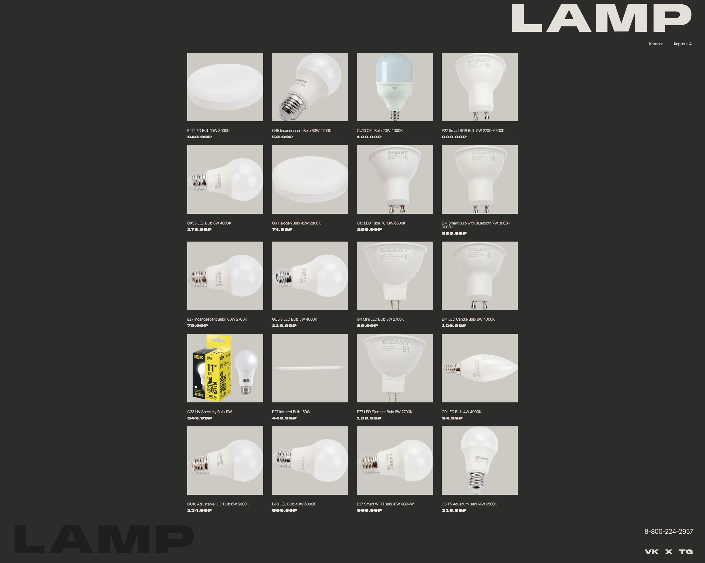
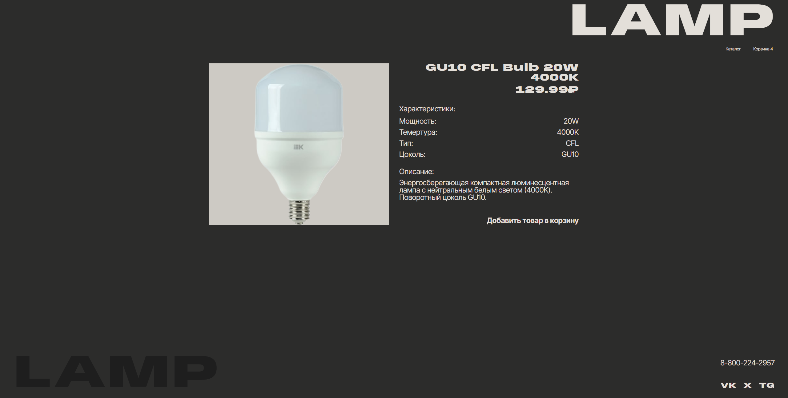
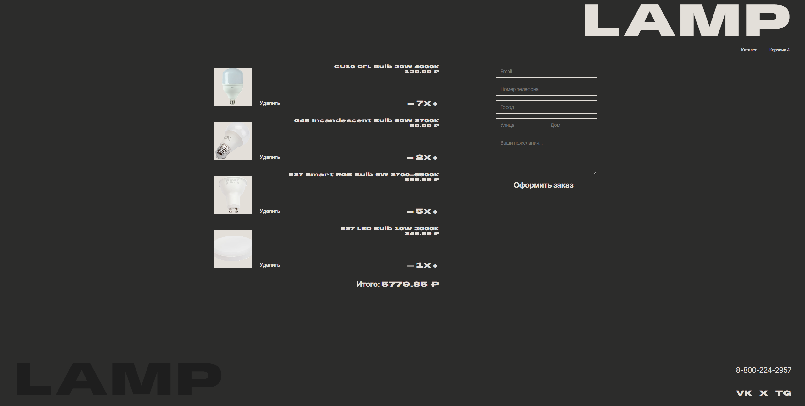
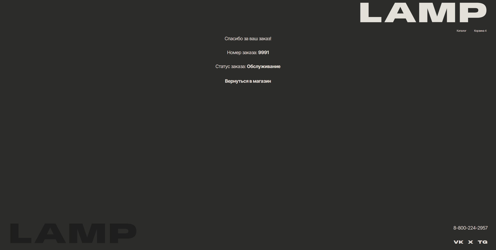

# Интернет-магазин ламп

В этом простом проекте представлен интерфейс интернет-магазина ламп. В данном репозитории находится код интернет-магазина ламп, созданный с помощью React, TypeScript, scss и Vite.

## Описание проекта

Проект представляет собой интернет-магазин, в котором пользователь может просматривать и покупать лампы. Магазин имеет следующие функции:

- просмотр списка ламп
- просмотр подробной информации о лампе
- добавление лампы в корзину
- просмотр корзины
- оформление заказа

## Как использовать

1. Клонировать репозиторий
2. Установить зависимости с помощью npm install
3. Запустить проект с помощью npm run dev
4. Открыть в браузере http://localhost:5173

## Скриншоты

